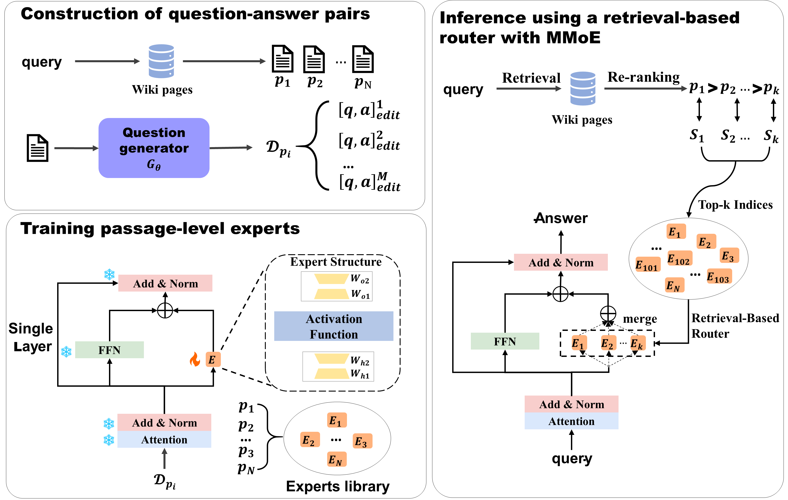

# MoPE: A Massive Mixture of Passage-Level Experts for Knowledge Editing in Open-Domain Question Answering

### RAGMoE


An overview of the proposed MoPE framework: 

1) Passage-Level Editing with MMoE: For a given passage, its QA pairs are automatically constructed using the fine-tuned question generator. The passage-specific expert is then trained within the MoE layer using these QA pairs.
2) Inference with Retrieval-Based Router: MMoE is deployed, where dense retrieval and a fine-tuned reranker are applied to select the top-retrieved relevant passages, and the corresponding passage-level experts are then incorporated to form a sparse MoE. The relevance vector of the router is computed based on either the top-1 or top-k passages.


### Re-ranker
We use the [**bge-reranker-v2-gemma**](https://huggingface.co/BAAI/bge-reranker-v2-gemma) as re-ranker base model in this work and extend our gratitude to its developers for their contributions to advancing re-ranking technologies.
1. Use the `./reranker/prepare_data.py` script to prepare the data for the re-ranker.
2. Training
3. After training, use the following code to merge model.
```bash
python -c "from FlagEmbedding.llm_reranker.merge import merge_llm; merge_llm('BAAI/bge-reranker-v2-gemma', model_dir, target_dir)"
```


### Question generator
The question generation part refers to the repository [question_generator](https://github.com/AMontgomerie/question_generator).

1. Generate the required training dataset using `./question_generator/create_dataset.py`.
2. Train the question generator. `./question_generator/qg_train.py`
3. Use the trained question generator. `./question_generator/run_qg.py`