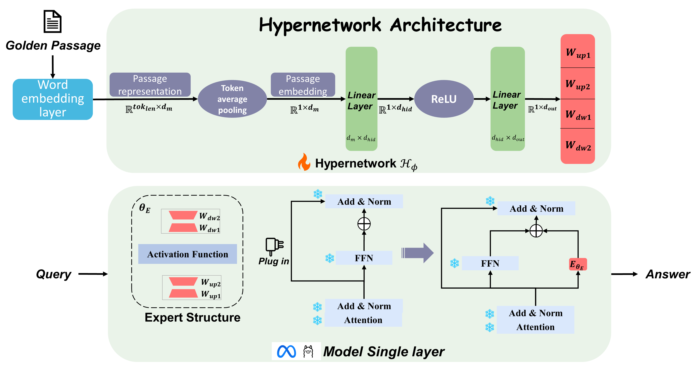

# GenPoE

This repository is based on the paper [GenPoE: Generalized Inner Product Operators for Parameter-Efficient Transfer Learning](https://openreview.net/forum?id=QRDLThn4jP).

---

## Ⅰ: Retrieval & Data Source
The retrieval model uses the **DPR** model. The weights and NQ/TQA data can be obtained using the `./dpr/data/download.py` script. 

For details, please refer to the original [**DPR** repository](https://github.com/facebookresearch/DPR/tree/main).

---
## Ⅱ: Training the Re-ranker

### 1. Prepare Training Data

Use the script `reranker/prepare_data` to prepare the training data.  
The data is constructed from the training sets of **NQ** and **TQA** into the following format:
```json
{
  "query": "question",
  "pos": "positive passage",  //Positive passages
  "neg": "negative passage",  //Negative passages
  "prompt": "Given a query A and a passage B, determine whether the passage contains an answer to the query by providing a prediction of either 'Yes' or 'No'."
 }
```

### 2. Train the Re-ranker
```bash
./train_reranker.sh
```
---
## Ⅲ: Main part


### 1.Training (train.py)

#### Training and HyperNetwork Workflow

This repository implements a training pipeline where a HyperNetwork generates expert parameters for a Mixture-of-Experts (MoE) model. The workflow consists of **retrieval**, **re-ranking**, and **expert parameter generation**, followed by **fine-tuning via the HyperNetwork**.

#### Data Preparation

Training data is prepared using the `make_Training_loader` function, which constructs batches of input sentences and tokenized tuples. Each batch contains:

- `tok_sentence`: tokenized passage input
- `tok_tuples`: tokenized input-output(QA) pairs for supervised training

#### Model Setup

1. The base model is created via `make_model(config)`  
2. The target MLP layer in the model is replaced with a Mixture-of-Experts (MoE) layer using `replace_layer(config, model, original_layer, num_experts=config.num_experts)`  
3. All original model parameters are frozen to ensure that only the HyperNetwork is trained:


### 2. Inference(inference.py)

#### Load Model and HyperNetwork

First, the trained HyperNetwork is loaded from a checkpoint. The base MoE model and tokenizer are also loaded, with all original model parameters frozen to ensure that only the HyperNetwork-generated expert updates are applied.


#### Prepare Validation Data

Validation data is prepared in a structured format including:

- Original queries
- Retrieved or reranked candidate passages
- Passages used to generate HyperNetwork deltas  
- Ground truth answers for evaluation  


####  Generate Expert Parameters

For each Passages to be activated, the corresponding embeddings are extracted from the model and passed through the HyperNetwork. The HyperNetwork produces parameter deltas, which represent updates for the MoE experts.


#### Apply Expert Updates

The generated deltas are injected into the target MoE layer before the forward pass. This effectively customizes the model for the current input by adjusting the expert parameters dynamically.


#### Model Prediction and Evaluation

The model generates predictions for the base(Query) and retrieved(Passage) inputs. Predictions are compared with ground truth answers using Exact Match (EM) and F1 metrics. Metrics are accumulated across all validation batches to provide an overall performance assessment.


---

## Acknowledgement

We would like to thank the developers of [DPR](https://github.com/facebookresearch/DPR/tree/main) and [BGE-Reranker](https://huggingface.co/BAAI/bge-reranker-v2-gemma) for making their work publicly available, which greatly facilitated our research.


